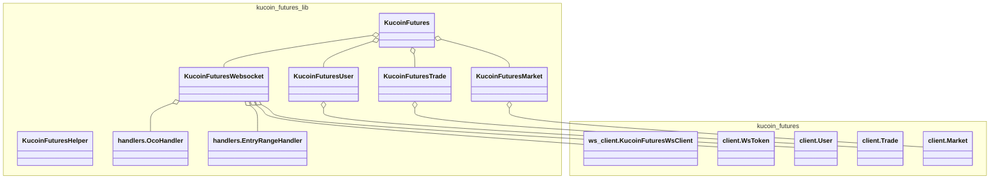

# Kucoin Futures Library

## Installation
```bash
pip install kucoin-futures-lib
```

## Class Structure


## Usage Examples

### Synchronous example:
```python
from kucoin_futures_lib import initialize_kucoinf
from utils import retriable

if __name__ == "__main__":
    kucoinf = initialize_kucoinf(
        api_key='your-api-key',
        api_secret='your-api-secret',
        api_passphrase='your-api-passphrase',
        # Optional retriable method to retry methods in the library
        retriable=retriable(retries=3, exceptions=(Exception,), backoff_base=2.0, initial_backoff=0.1),
    )
    order_id = kucoinf.trade.create_order(
        instrument="XBTUSDTM",
        side="buy",
        size=3,
        leverage=10,
    )
    print(f"Order ID: {order_id}")

    tp_order_id, sl_order_id = kucoinf.trade.create_stop_loss_and_take_profit(
        instrument="XBTUSDTM",
        side="buy",
        take_profit=75000,
        stop_loss=60000,
    )
    print(f"Take profit order ID: {tp_order_id}")
    print(f"Stop loss order ID: {sl_order_id}")

```


### Asynchronous example:
```python
import asyncio
from kucoin_futures_lib import initialize_kucoinf
from kucoin_futures_lib.utils import retriable


async def main():
    kucoinf = initialize_kucoinf(
        api_key='your-api-key',
        api_secret='your-api-secret',
        api_passphrase='your-api-passphrase',
        # Optional retriable method to retry methods in the library
        retriable=retriable(retries=3, exceptions=(Exception,), backoff_base=2.0, initial_backoff=0.1),
    )
    balance = kucoinf.user.get_balance(currency='USDT')
    print(f"Account balance: {balance}")

    current_price = kucoinf.market.get_current_price(instrument='XBTUSDTM')
    print(f"Current price: {current_price}")

    order_id = await kucoinf.create_order(
        instrument="XBTUSDTM",
        side="buy",
        size=3,
        take_profit=75000,
        stop_loss=60000,
        leverage=10,
        enable_oco=True,
    )
    print(f"Order ID: {order_id}")


def start():
    """Start the main function."""
    loop = asyncio.get_event_loop()
    loop.run_until_complete(main())


if __name__ == "__main__":
    start()
```


